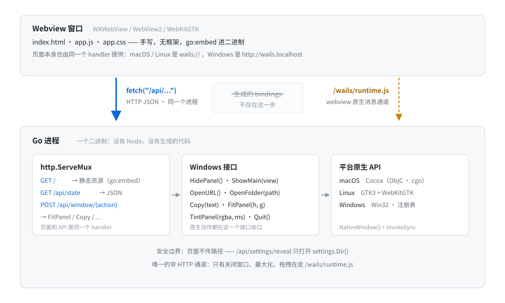
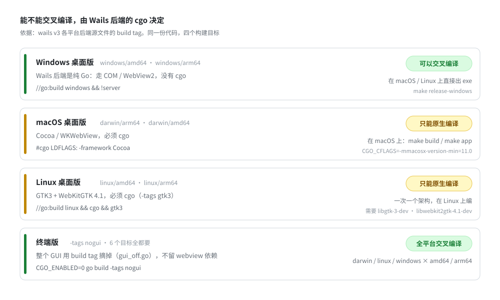

# 不用 wails3 CLI：把 Wails v3 当普通 Go 库写桌面应用
> 2026-09-26 23:33:39

---

[magpie](https://github.com/yetone/magpie) 是一个管理各种 AI Agent 模型配置的桌面应用（macOS 菜单栏面板 + 主窗口）。翻它的源码会发现一件奇怪的事：

- 没有 `wails.json`
- 没有 `frontend/` 目录
- 没有 `package.json`，没有 node_modules
- 整个仓库 grep 不到一次 `wails3`

但它的 GUI 确确实实是 Wails v3 写的（`go.mod` 里躺着 `github.com/wailsapp/wails/v3`）。它的构建方式就一句话：

```make
go build -tags production -trimpath -ldflags="-s -w -X main.version=$(VERSION)" -o magpie .
```

这篇文章拆一下它是怎么做到的，以及这种写法适合什么场景。

---

## 1. Wails 的两种用法

大多数人用 Wails 是这样的：

```bash
wails3 init -n myapp
wails3 dev
wails3 build
```

这套流程背后，`wails3` CLI 其实做了四件事：

| CLI 子命令 | 做的事 |
| --- | --- |
| `generate bindings` | 扫描 Go 结构体，生成 JS/TS 客户端代码 |
| `dev` | 起前端 dev server + 热重载 |
| `build` | 跑前端构建（npm/vite），把产物 embed 进二进制 |
| `package` | 打包成 .app / .exe 资源 / .deb / 安装器 |

而 Wails v3 的 `application` 包本身就是一个普通的 Go 库。`application.New()` 收一个 `Options`，其中 `Assets` 字段要的是一个 `http.Handler`：

```go
h.app = application.New(application.Options{
    Name: "magpie",
    Assets: application.AssetOptions{Handler: handler},
    // ...
})
```

**这个 `http.Handler` 就是全部的钥匙**。既然前端资源由一个普通的 Go handler 提供，那"前端怎么拿到数据"就完全是你自己的事——bindings 生成器从"必需品"变成了"可选项"。

magpie 把这个可选项整个扔掉了。

---

## 2. 绑定生成的替代品：一个 HTTP JSON API

`internal/gui/api.go` 的包注释写得很直白：

```go
// Package gui hosts the desktop app: a tray panel and a regular window that
// share one small web UI. The UI talks to Go over a tiny JSON API served by
// the same handler that serves the static assets, so no binding generator or
// bundler is involved.
```

所以架构是：



注意页面自己的来源：macOS / Linux 上 webview 加载的是 `wails://` 自定义 scheme，Windows 上是 `http://wails.localhost`，都指向 Wails 内部那个 asset server——也就是上面这个 `Handler`。**所以 `fetch("/api/...")` 打的是同进程的 mux**：没有 IPC，没有 bindings，没有代码生成，没有序列化协议，只有 HTTP。

前端侧的封装小到可以忽略：

```js
async function api(path, body) {
  const res = await fetch("/api/" + path, {
    method: body === undefined ? "GET" : "POST",
    headers: { "Content-Type": "application/json" },
    body: body === undefined ? undefined : JSON.stringify(body),
  });
  if (res.status === 204) return null;
  const data = await res.json();
  if (!res.ok) throw new Error(data.error || res.statusText);
  return data;
}
```

配套的好处是意外收获：既然 UI 就是一个普通网页 + 普通 HTTP API，那**在浏览器里打开它就能调试**，devtools 全套可用，不需要任何 Wails 专属的调试姿势。

---

## 3. 前端构建的替代品：`go:embed` + 手写 assets

`internal/gui/assets/` 里是几个手写的文件：`index.html`、`app.js`、`app.css`、`i18n.js`，没有框架，`app.js` 第一行就写着 "No framework"。整个前端用一行 embed 进二进制：

```go
//go:embed assets
var assets embed.FS
```

dev 模式（`-tags dev`）则换成 `os.DirFS`，每次请求都从磁盘读，文件改了页面自己刷新。更进一步的是，它把开发态拆成了两个进程：

```
make dev  →  shell 进程（管窗口和托盘）
          →  backend 进程（管 API 和网关）
```

改 Go 代码只重启 backend，窗口不关——页面收到通知后原地刷新数据，连当前 tab 和展开状态都不丢。这套东西自己写了大概 9KB（`dev_on.go`），wails3 CLI 的 `dev` 命令在这里被完全跳过了。

---

## 4. 打包的替代品：Makefile

`wails3 package` 干的活，这里全部手写，各自也就十几行：

**macOS** —— 手拼 `.app` bundle：

```make
app: build
	@rm -rf magpie.app
	@mkdir -p magpie.app/Contents/MacOS magpie.app/Contents/Resources
	@cp magpie magpie.app/Contents/MacOS/magpie
	@cp build/darwin/magpie.icns magpie.app/Contents/Resources/magpie.icns
	@sed 's/@VERSION@/$(VERSION)/' build/darwin/Info.plist > magpie.app/Contents/Info.plist
```

（连图标都是自己写的 Go 程序生成的：`go run build/icon/gen.go`，用 `iconutil` 合成 `.icns`。）

**Windows** —— 用 `go-winres` 生成 `.syso`（图标 + manifest + 版本信息），再用 `-H windowsgui` 去掉控制台：

```make
@go run github.com/tc-hib/go-winres@v0.3.3 make --in build/windows/winres.json --arch amd64,arm64 --out rsrc ...
CGO_ENABLED=0 GOOS=windows GOARCH=$$arch go build -tags production -ldflags="-H windowsgui" -o dist/magpie-windows-$$arch.exe .
```

**Linux** —— 一个裸二进制，没有 .deb / AppImage（也就没这部分维护成本）。

另外，CLI 平时会顺手帮你加的 `-tags production`（切换 Wails 的 debug / production 资源加载模式），这里也是 Makefile 里手写的。

---

## 5. 最有价值的部分：跨平台编译的真实图谱

这是整个写法里最"硬"的一节，因为它由 Wails 库本身的构建约束决定，跟用不用 CLI 无关。

翻一下 Wails v3 源码，各平台后端的 build tag 是这样的：

```go
// application_windows.go
//go:build windows && !server          ← 没有 cgo

// application_darwin.go
//go:build darwin && !ios && !server
#cgo CFLAGS: -mmacosx-version-min=10.13 -x objective-c
#cgo LDFLAGS: -framework Cocoa        ← 必须 cgo

// application_linux_gtk3.go
//go:build linux && cgo && gtk3        ← 必须 cgo
```

推论非常清晰：

- **Windows 后端是纯 Go**（走 COM / WebView2，没有 cgo），所以 Windows 的 GUI **可以交叉编译**，在 macOS 或 Linux 上一条命令出 amd64 + arm64 两个 exe。
- **macOS 和 Linux 后端要 cgo**（Cocoa / GTK + WebKitGTK），只能**在目标平台原生编译**，一次一个架构。



magpie 的 Makefile 就是照着这个图谱写的：

```make
release: clean build          # 本机（macOS）的 .app
release-cli:                  # 6 个目标全交叉编译（CGO_ENABLED=0 + nogui）
release-windows:              # Windows GUI，amd64 + arm64，交叉编译
release-linux:                # Linux GUI，本机架构，原生编译
```

Makefile 里的注释也把原因写清楚了：

```make
# The GUI links the platform webview through cgo, so it is built natively.
# `nogui` builds the terminal-only magpie, which cross-compiles anywhere.
```

还有个漂亮的收尾：整个 GUI 依赖可以用一个 build tag 摘掉。

```go
// gui_on.go
//go:build !nogui
const hasGUI = true

// gui_off.go
//go:build nogui
const hasGUI = false
```

于是 `CGO_ENABLED=0 go build -tags nogui` 得到的是一个**任何平台都能交叉编译**的纯 CLI 版本，六个 GOOS/GOARCH 一把梭。同一个仓库、同一份业务代码，GUI 和 CLI 只是两个 tag 的差别。

这也解释了它们的 CI 长什么样：测试在 ubuntu / macos / windows 三个 runner 上跑（Linux 上要先 `apt install libgtk-3-dev libwebkit2gtk-4.1-dev`），发版则交给专门的仓库在原生 runner 上构建、签名、公证。

---

## 6. 原生能力怎么用：`NativeWindow()` 逃生舱

Wails 封装了托盘、菜单、剪贴板、窗口这些常规能力，但总有封装不到的地方。Wails v3 的逃生舱是 `w.NativeWindow()`——拿到平台原生窗口指针，然后你自己跟它说话。

magpie 用这个逃生舱做了不少事：

**macOS**：一整段 Objective-C 直接写在 Go 文件里（cgo），做托盘面板的下滑动画——让系统用自己的显示时钟跑动画，而不是在 Go 里一帧帧设窗口大小：

```c
static void glidePanel(void *w, int height, int ms, double x1, double y1, double x2, double y2) {
	NSWindow *win = (NSWindow *)w;
	dispatch_async(dispatch_get_main_queue(), ^{
		NSRect to = NSMakeRect(f.origin.x, NSMaxY(f) - height, f.size.width, height);
		[NSAnimationContext runAnimationGroup:^(NSAnimationContext *ctx) {
			ctx.duration = ms / 1000.0;
			ctx.timingFunction = [CAMediaTimingFunction functionWithControlPoints:x1 :y1 :x2 :y2];
			[[win animator] setFrame:to display:YES];
		} ...];
	});
}
```

同一文件里还往 WebView 底下插了一层 `CALayer` 做背景染色（顺便用私有 KVC `drawsBackground` 关掉 WebKit 自己的背景色），以及用 `[NSApp setActivationPolicy:]` 控制要不要显示 Dock 图标。

**Linux**：cgo 调 GTK，用"塞一个隐藏 widget 当标题栏"的招数去掉系统标题栏，同时保住阴影、圆角和边缘缩放：

```c
#cgo pkg-config: gtk+-3.0
static void plain_titlebar(void *w) {
	GtkWidget *bar = gtk_box_new(GTK_ORIENTATION_HORIZONTAL, 0);
	gtk_widget_set_no_show_all(bar, TRUE);
	gtk_window_set_titlebar(GTK_WINDOW(w), bar);
}
```

**Windows**：直接写注册表注册 `magpie://` 协议；手拼 `explorer.exe "path"` 的命令行（绕过 Go 的转义，因为 Explorer 读的是自己的命令行）；甚至用 `AttachConsole(-1)` + `CONOUT$` 让 GUI 程序从终端启动时还能正常打印。

这些代码全部在多处调用 `application.InvokeSync` 切回 UI 线程——**自由是拿"自己管线程、自己管生命周期"换来的**，而且 `NativeWindow()` 这类 API 在 beta 期间并不稳定。

---

## 7. 前端怎么够到这些原生能力：HTTP 包一层

这是我觉得最优雅的一点。所有原生动作用 HTTP 统一包了起来——`internal/gui/api.go` 里的 `Windows` 接口就是这层抽象：

```go
type Windows interface {
	HidePanel()
	ShowMain(view string)
	Quit()
	OpenURL(url string)
	OpenFolder(path string) error
	Copy(text string) bool
	FitPanel(height int, g Glide)
	TintPanel(rgba [4]uint8, ms int) bool
}
```

前端调的每一个动作，最终都是发一个 HTTP 请求：

| 原生动作用 | 前端调用 | 落到 |
| --- | --- | --- |
| 面板伸展 + 原生动画 | `api("window/fit?h=&ms=&ease=")` | `FitPanel` → ObjC |
| 面板染色淡入 | `api("window/tint?c=rgba&ms=")` | `TintPanel` → CALayer |
| 关面板 / 开主窗 / 退出 | `api("window/hide\|main\|quit")` | `HidePanel` 等 |
| 文件管理器打开目录 | `POST /api/settings/reveal` | Explorer / Finder |
| 复制到剪贴板 | `POST /api/copy` | `app.Clipboard` |
| 系统浏览器开链接 | `POST /api/open` | `app.Browser.OpenURL` |
| OAuth 登录 | `POST /api/signin` + 轮询 | 拉起浏览器 |

链路整体长这样：

```
JS:  api("window/fit?h=320&ms=180")
 └→ POST /api/window/fit                       ← 纯 HTTP
     └→ host.FitPanel → glidePanel → C.glidePanel(...)   ← 原生 NSWindow 动画
```

而且因为它完全是个 HTTP 接口，安全边界也变得可设计。两个细节：

- 页面**不能传路径**。`/api/settings/reveal` 写死只打开配置目录，注释原话是 "the page names no path, so it can't open others"。
- 导入别家应用的 API Key 时，key 只在 Go 侧读，回给页面的是 mask 过的版本。

### 唯一的例外：`/wails/runtime.js`

HTTP 覆盖不了的只剩"窗口管理器"那点事——拖拽、关闭、最大化，这些必须是 webview 自己的原生通道。所以前端里有第二条、也是唯一一条非 HTTP 通道：

```js
// 浏览器里打开时 runtime 不存在，catch 掉即可
const winRuntime = mode === "window" ? import("/wails/runtime.js").catch(() => null) : Promise.resolve(null);

$("#winclose").onclick = () => winRuntime.then((w) => w?.Window.Close());
// Linux 双击头部最大化
winRuntime.then((w) => w?.Window.ToggleMaximise());
```

这个 `runtime.js` 是 Wails 库自带的，背后走各平台 webview 的原生消息通道：macOS / Linux 是 `window.webkit.messageHandlers.external.postMessage`（WKWebView / WebKitGTK 的 script message handler），Windows 是 `window.chrome.webview.postMessage`（WebView2）。再加上 CSS 里的 `--wails-draggable: drag` 标记拖拽区——**这三个就是全部的"非 HTTP"交互**。

---

## 8. 代价与边界

我不想把这套写法说得只有好处，它是有明确代价的：

**1. 类型安全靠人肉。** bindings 生成器存在的意义是让 Go 结构体和 TS 类型永远同步；手写 HTTP 意味着改一个字段名，JS 那边不会报错，只能靠测试兜。magpie 的做法是写了不少针对 API 的测试来补偿。

**2. 打包全手工。** `Info.plist`、`.icns`、`winres.json`、Windows 的 DPI manifest……这些 `wails3 package` 本来会帮你做的事，现在都是自己的维护成本。而且代价的另一面是：Linux 只发裸二进制，`.deb` / AppImage / 桌面项都没有。

**3. 一些基建要自己写。** 热重载、dev 双进程、更新安装（它甚至自己实现了下载新版替换 `.app`，权限不够时用 `osascript` 提权），加起来是几千行自己的代码。

**4. 并没有完全解耦。** `/wails/runtime.js`、`--wails-draggable` 这些运行时约定还是 Wails 的，而且版本锁在 beta。

**5. 实时推送会开始别扭。** 想看"请求实时路由到哪"这种流，用的是 25 秒长轮询（`GET /api/gateway/trace?after=<seq>&wait=1`），而不是 Wails 自带的事件通道。对"看请求往哪走"这个频次够用；如果每秒几十条事件，就该想念 `Events.Emit` 和生成的绑定了。

**所以适用边界很清楚**：这套写法成立的前提是

- UI 小到可以手写，不需要 React/Vue 那种构建链；
- 对原生的需求都是"动词"（开窗、动窗、复制、开目录），而不是持续的数据流；
- 作者本来就想要一个 HTTP API（magpie 首先是个本地网关，HTTP JSON 是顺理成章，不是硬拗）。

换成一个大前端 + 复杂状态同步的项目，丢掉 bindings 的痛感会立刻超过省下的工具链。

---

## 9. 小结

magpie 的做法，本质上是**用"库"而不是"框架"的姿势使用 Wails v3**：

- **bindings** → 自己写 HTTP JSON API（页面和 API 同一个 `http.Handler`）
- **前端构建** → 手写无框架 assets + `go:embed`
- **dev** → 自己实现的热重载，甚至拆成 shell / backend 双进程
- **打包** → Makefile，各平台十几行
- **跨平台** → 顺着 Wails 后端的 cgo / 非 cgo 约束：Windows 交叉编译，macOS / Linux 原生编译
- **原生能力** → `NativeWindow()` + cgo 逃生舱，再用 HTTP 统一包给前端

`wails3` 那五个子命令（`init` / `generate bindings` / `dev` / `build` / `package`）一个都没用上——因为当你不写框架式的大前端、又把后端当成一个 HTTP 服务时，它们本来解决的问题就不存在了。

代价是：你得自己维护那些"本来有人替你生成"的东西。这笔账划不划算，取决于你的项目是哪一类。

---

*仓库地址：<https://github.com/yetone/magpie>（MIT）*
